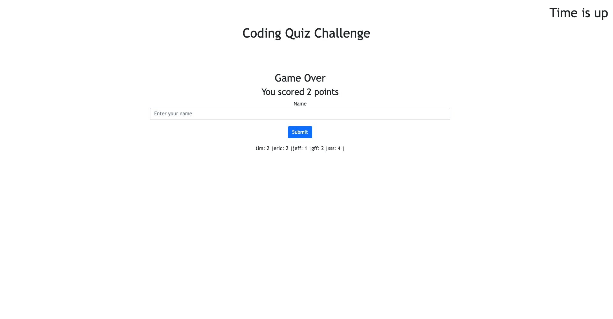

# Code Quiz

## Description

This is a short quiz about European soccer. It was a good learning experience to work with local storage and j query.

## Installation

The project can be accessed through the repository or the deployed link below.  
[Code Quiz](https://nhilde.github.io/CodeQuiz/)

## Usage

Click the start button to begin the quiz. When finished, enter your name and submit your score to the scoreboard.

